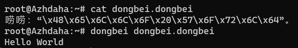
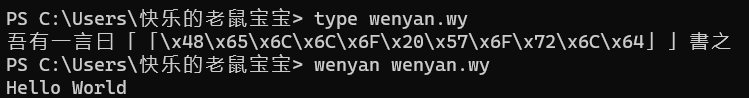

# 鼠宝宝的挑战作品 `NLP in NLP`

> **Natural Language Processing** in **Natural Language Programming**

大家好，其实一开始是打算用Python打一下ASCII码，但绕不开`ord()`和`chr()`函数，因此改为用Unicode显示。

```python
print(u'\u0048\u0065\u006C\u006C\u006F\u0020\u0077\u006F\u0072\u006C\u0064')
```

然而一切完备之时，糟糕，`print`含有`Hello World`中的`r`，因此改为使用[wenyan-lang](https://github.com/wenyan-lang/wenyan)用中文的保留函数名绕开`print`陷阱。为了减少代码体积，改为使用另一门自然语言编程语言[dongbei-lang](https://github.com/zhanyong-wan/dongbei)来完成挑战。

因本人用不同语言参加比赛，故指定dongbei-lang版本作为冲榜计分的提交。wenyan-lang版本作为不计分的提交，仅供博君一笑，弘扬中华文化。

## dongbei-lang （冲榜计分）

* 展示代码：[嘎哈呢.dongbei](嘎哈呢.dongbei)

```dongbei-lang
唠唠：“\x48\x65\x6C\x6C\x6F\x20\x57\x6F\x72\x6C\x64”。
```

* 验证截图：[dongbei-lang-validation.png](dongbei-lang-validation.png)




## wenyan-lang （不计分）

* 展示代码：[問天地好在.wy](問天地好在.wy)

```wenyan-lang
吾有一言曰「「\x48\x65\x6C\x6C\x6F\x20\x57\x6F\x72\x6C\x64」」書之
```

* 验证截图：[wenyan-lang-validation.png](wenyan-lang-validation.png)


